调整下结构（如关于广发放在，在结束，介绍公司最终）
关于微服务和api server 放在最后（如新东西，放在koa2，node.js后期啊）
koa2 adapter 再讲些（如老旧的是什么对比）
停顿，精简部分（少讲些，如graphql，）
全量广发技术栈（整体印象，让听众有全局认识）
缩进web开发到日常开发中(一页）
开头页面跳转下行间距等


## Node.js 在广发证券：koa2 和 微服务实战新一代API Server

### 自我介绍

- 豌豆荚 - WebApp
- 广发证券 - Hybrid App && Node.js 开发
- [我的博客](https://github.com/gaohailang/blog) （一些技术上的思考和分享）

```note
前几位的分享都特别棒，最后我给大家带来的topic是讲述我们广发证券这样一个传统券商在新技术微服务，koa上的一些使用尝试的经验。

先来个简单的自我介绍：我毕业前在百度实现做前端开发的一些工作，临近毕业决定去豌豆荚这家创业公司做WebApp开发（angular）。接下来从去年开始到目前所在的广发证券，玩了下之前一直想尝试的混合应用的开发，而现在主要是focus在Node.js在团队内部的使用和推广上。

私下我对技术还是非常感兴趣，会有自己的一些思考和理解，会翻译和写一些文章在网上。


```

### 分享大纲

* 我们是谁
* 我们和开源
* 我们对 Node.js 的定位
* API Server 和 Node.js
* 微服务 和 Node.js
* Koa2 和 Node.js
* 日常开发 与 Node.js
* Web 开发 和 Node.js

```note
今天我要分享的agenda大致是：
先讲下我们技术实践产生的背景 - 即我们这家公司团队是谁，然后今天的主角node.js的在团队的定位，然后正式进入主题前会回顾下目前的API Server的发展和未来，从而正式进入实施的部分。
普通的node开发，koa2相关的实践，node应用上下游组件如数据库负载均衡等，最后以高大上的微服务结尾。
// 如果时间允许会看下我们在开源的贡献和参与。
```


### 我们是谁

#### How - 我们是怎么做的

- 金融创新


- 技术前沿（bleeding - edge）
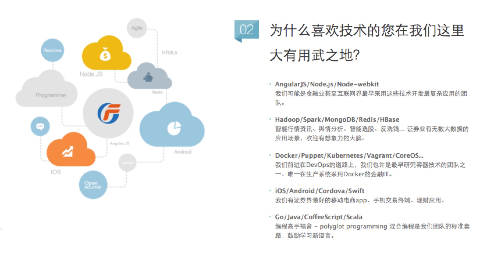


```note
那我们是谁呢，广发证券，国内的TOP3的券商的信息技术部门。
从13年开始，我们已经重视相关技术fintech，
我们希望和国际投行对肩(『证券行业创新高涨，国际化进程中，投行等』)（IT人员会占到 1/3的比例，国内远远不到）
我们的技术选型时非常前言的，最早运用这些技术框架开发复杂运用的公司了（金融？
```


#### 这样选型的原因

- 吸引爱玩技术的你们
- 解决问题弯道超车
- 形成学习型组织

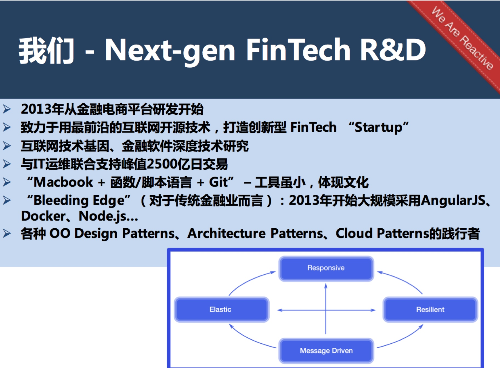


```note
为什么这么做了，激进的采用这样的方式，首先这些新的基于互联网的业务上允许了。然后最主要还是人员上的思考。
我们需要这样的技术态度，来吸引想在座爱玩技术的你们，然你们用这些新技术带我们弯道超车（要知道这些开源技术很多时候比原本自研的强多了社区强以后找工作也好找，偷笑），最终我们致力于建立学习型组织在现在高速发展的技术世界保持前沿，而不是全被耦进入复杂业务中。

所以在13年我们就开始大量的使用诸如angularjs，node.js来构建我们的应用。那么Node.js在我们公司技术栈到底是什么定位呢？

// 去看我们的一些技术选项前，先看看我们是什么样的组织，再看看我们对开源技术的态度，这样才能得出一些背后的原因，也给你们一些技术参考。
//（我是较高复杂度的譬如购买一个理财产品很多逻辑的判断和，流量上的倒不是很大，但业务上流动的钱到时候百千万到亿的~，其次我们推崇的微服务就允许让我们xxx（因为它xxx
```


### 我们对 Node.js 的定位

#### 我们的技术全景图

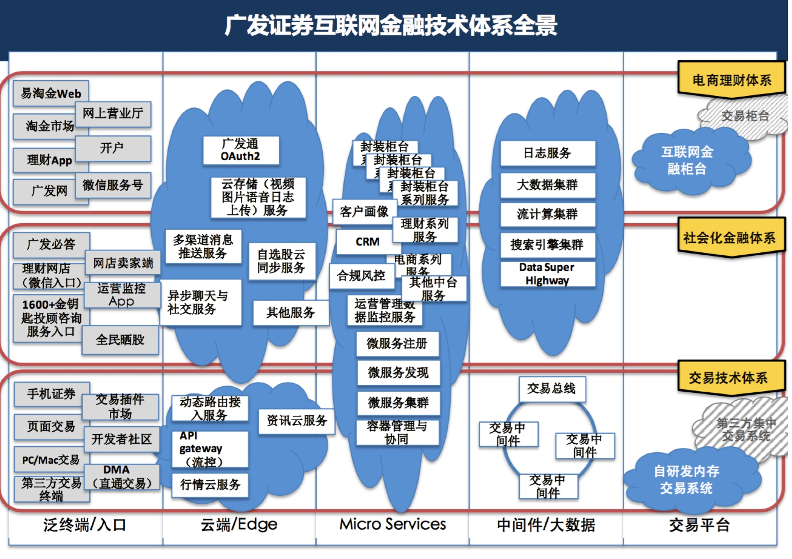


```note
这是我们的技术体系全景图（对它感兴趣的会后可以详细在看），我们先要看第二列云端/edge部分，就这里就是我们nodejs发光发热的部分（它在接入层非常灵活的对接前面各种终端入口请求，做他合适做的事情）
然后在后面与第三列的微服务结合连同背后的更后端的东西。
```


#### 和微服务架构结合

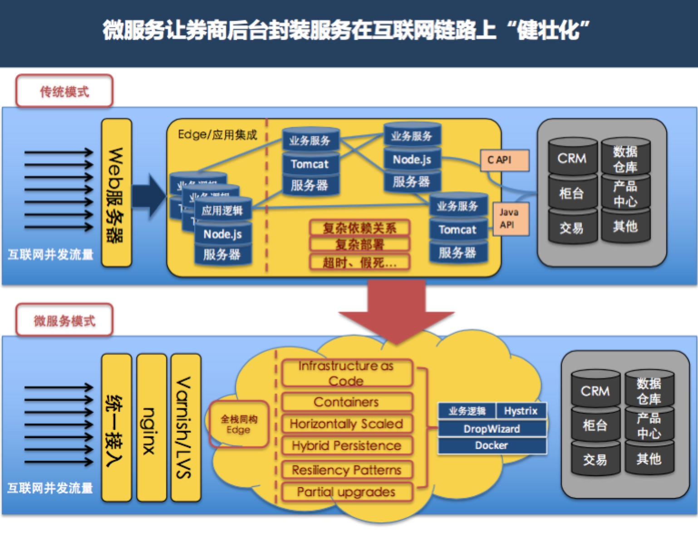


```note
并且从去年开始，我们推崇从接入层之后到柜台之前都变微服务，在保证接口服务的健壮性的同时，提供接入层聚合原子化到具体用户场景下的接口。 对微服务不熟悉的没关系，在最后我们会回到他们看和node.js的结合。


// 首先看下我们的全景图xxx，从泛终端作为入口，到我们的云端edge，对接micro services，后面有中间件和大数据backup，最终对标交易平台。
// 在我们的云端edge就大量使用着node。js来做它适合做的事情，甚至一些对性能不那么苛刻的微服务也有js来构建的（如果解决好类型等开发复杂应用稳定性
	•	原子化服务 – 细粒度、独立部署、独立维护升级、独立扩容 
	•	所有服务内置平台层、应用层监控(Google Dapper类技术)
• 金管家、金钥匙、易淘金、开户系统。。。功能拆分、微服务容器、云化 
• 应用层“聚合” – 不同应用场景聚合不同的微服务 
可以看到我们的架构中
（性能速度损耗，但是用户不care，可能被传统的金融银行等『惯坏』了，关于钱财的还是别轻飘的好
```


### API Server 和 Node.js

```note
好，现在我们知道了我们要实施一个强大的API Server，那在正式动手撩开袖子搞之前，
有必要看下在更广的视野下它。因为在过于一段时间它们改变了不少。
```

#### 不同时代的Server

- Backend 渲染页面 + 部分 Ajax
- 前后分离 RESTful（或 db access）
	- RESTful extend
- API Server 新方向
	- graphql & falcor
	- Meteor

```note

最早的后端渲染页面，通过ajax来满足部分简单的前台交互（这时候后端MVC已经成熟 譬如rails, php,django 都是此中好手。

然后随着移动客户端iOS/Android快速发展和前端webapp化，越来越多的应用逻辑前移，富应用要求动态页面从而把渲染前移，所以此时接口要前后分离，所以restful这种基于资源为中心，加之行动动作的接口框架和规范就流行起来。

但是问题还是有的：如资源接口的聚合上，接口数据的适用性上，要知道页面上不会那么傻傻的仅仅对应单个资源。
所以有些基于RESTful扩展的协议，同时在新时代的，如grpahp来解决这些问题。把更大的权限移到前段

```

#### RESTful

- Optional-Field
- Filter & Sort
- Pagination
- Embedded & Sub Resource
- Bulk Inserts

```sh
/people?where={"lastname": "Doe"}
/people?sort=city,-lastname
?sort=[("lastname", -1)] - mongodb style
/people?projection={"lastname": 1, "born": 1}
/comment/?embedded={"author": 0}

curl -d '[{"firstname": "barack", "lastname": "obama"}, {"firstname": "mitt", "lastname": "romney"}]' -H 'Content-Type: application/json' http://eve-demo.herokuapp.com/people
```


```note
RESTful有它的几层的成熟度模型，业界如 Hekru 提供的指南。对于 JSON API 我们需要在类似于opt-field筛选特定字段，嵌入关联资源等进行统一抽象的接口理解

// 看起来每个开发者最后都会疑问那么关于API接口呢？很多人会直接想到RESTful API（因为太流行了），同时SOAP真的成为过去式了。同时现在也有不少其他标准如：HATEOAS, JSON API,HAL,GraphQL 等
```


#### API Server 新方向

- GraphQL & Relay
	- https://github.com/RisingStack/graphql-server
- Falcor


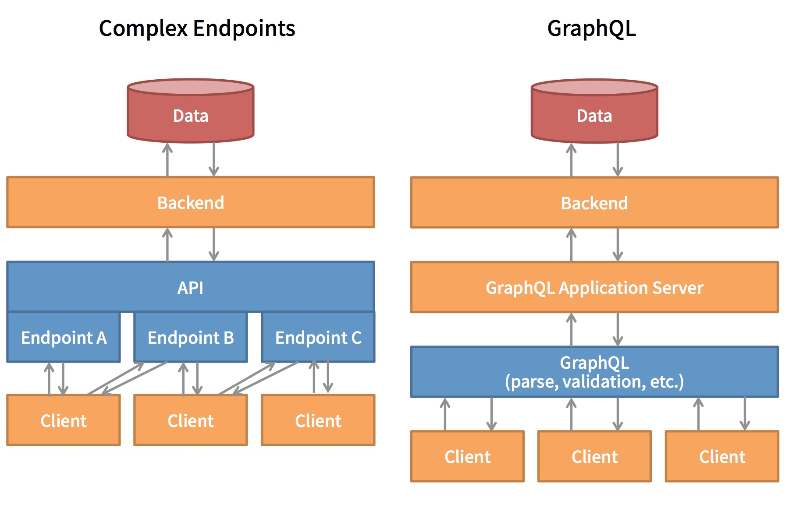

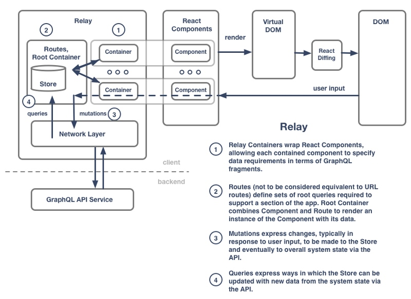

```note
GraphQL 赋予客户端强大的能力（也是职责），允许它来实施任意的查询接口。结合Relay，它能为你处理客户端状态和缓存。在服务器端实施GraphQL看起来比较困难而且现有的文档大部分是针对Node.js的

网飞(NetFlix）的Falcor 看起来它也能提供那些Relay和GraphQL提供的功能，但是对于服务器端的实现要求很低。但现在它仅仅是开发者预览版没有正式发布。
```

#### Meteor

http://www.slideshare.net/MeteorJS/meteor-intro2015

- LiveQuery, DDP, publication/subscribe, remote method


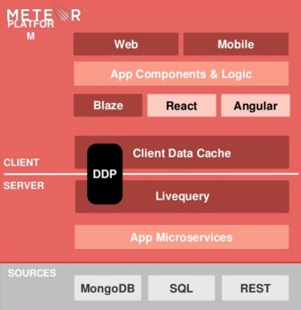

```note

需要值得一提的是，Meteor，算是异类但是通过类似DDP，Remote Method，pub/sub等非常高效的完成了前后端的数据同步。想想看，前端说模板绑定时需要绑定最新的用户feed，那么通过live query，每次数据库的内容变化，模板就会重新绑定，你不用说任何底层的。

我不认为现在有什么方案是个大满贯（完美的），所以我们还是需要结合我们的场景实现自己的API Server。这里我们就引进了koa2。
```


### Koa2 与 Node.js

#### What

- 它是什么
- 何时发布
- 哪些改动

```note

我们先首先来看koa2是什么. koa 我们都知道是由 Express 原班人马打造的，更小、更富有表现力、更健壮的 Web 框架。通过组合不同的 generator，可以免除重复繁琐的回调函数嵌套，并极大地提升错误处理的效率. 而koa2是通过es7的async/await 来进一步完善异步操作。关于express5和koa的历史可以看这篇文字.

它还没有正式发布，官方会等到node.js实现了async/await后在正式发布。 
所以需要xxxx

它的一些具体改动也就是体现在xxx，后续我们会具体看。
```

#### Why

- 1 NIO 同步写法
- 2 错误处理
- 3 中间件
    - response-time 展示

```note
（比起generator更直白，需要wrap，co，yield，* 这些是什么鬼？！）

promise 处理任何异常（explicit and implicit）在异步代码块中（inside then），只需要在 promises chains 链最后加上 .catch(next) -- promise 很不错的异步原语，但是有些 verbose


和 promise 紧密结合（await 一个 promise 的返回，如果 err 就抛异常） - try catch

可能的问题：await 只能运用在 async 的 function 定义中，所以你的代码中可能会有大量的 async 函数

可能的问题：be careful to wrap your code in try/catches, or else a promise might be rejected, in which case the error is silently swallowed. (!) - 或者在 top level 用 try/catch 包下


之前express的错误处理相信大家也都知道同步错误可以在app.use的next error-handling middleware，但是对于异步代码中却无能无力因为在你进入回调中已经丢掉调用栈了。除非要在每个node.js惯例的error-first的callback中，手动处理或者把他next出去往上推。 
统一的错误处理意味着，就是同步代码的异常如json.parse对一个非常字符串进行转意时可以捕获，对于类似于await，promise的reject也能捕获住。


中间件的写法也更直观了，这个是koa也都用的优势。


```

##### 同步代码

一些例子展示（从search.js等中摘取

```js
const fsp = require('fs-promise');

async function readDirContent(doc) {
  let paths = await fs.readdir('docs');

  let files = await paths.map(function(path){
    return fs.readFile('docs/' + path, 'utf8');
  });

  this.type = 'markdown';
  this.body = files.join('');
};
```

```js
  async function fetchSepcialShops (ctx, next){
    var spNumTypeMap = ['manager', 'developer', 'userFav'];
    ctx.checkQuery('tradeId', 'Invalid trade id').notEmpty();
    ctx.checkQuery('shopId', 'Invalid shop id').notEmpty();
    if(!isReqRight(ctx)) return;

    var {tradeId, shopId} = ctx.request.query
      , userId = ctx.request.get('userId'), reses;
    var [r1, r2, r3] = await Promise.all([
      rp({url: storeSpShopList, qs: {type: 1, userId: tradeId}}),
      rp({url: storeSpShopList, qs: {type: 2, userId: tradeId}}),
      userId ? rp({url: userFavShopList, headers: {userId}, qs: {
        shopId, from: 1, size: 5
      }}) : {}
    ]);
    ctx.body = _.zipObject(spNumTypeMap, [r1.data, r2.data, _.map(r3.data, 'shop')]);
  }
```

##### 错误处理

```js
// error handler to JSON stringify errors
const errorRes = require('./middleware/error-res');
app.use(errorRes);

module.exports = async function(ctx, next) {
  try {
    await next();
  } catch (err) {
    if (err == null) {
      err = new Error('Null or undefined error');
    }
    // some errors will have .status
    // however this is not a guarantee
    ctx.status = err.status || 500;
    ctx.type = 'application/json';
    ctx.body = {
      success: false,
      message: err.stack
    };
    ctx.app.emit('error', err, this);
  }
};

// 用于关闭前的一些处理如保存数据，记录错误，发送邮件等等
process.on('uncaught', ()={});
```

```note
callback: domain, 异步错误需要next(err)，同步异常的try-catch等， domain被废弃掉，app.use((err, req, res, next))的忽略
所以顶层的try-catch 的放置顺序
```


##### 中间件写法

```js
function responseTime() {
	return async(ctx, next) => {
	  var start = Date.now();
    await next();
    var delta = Math.ceil(Date.now() - start);
    ctx.set('X-Response-Time', delta + 'ms');
	}
}
```

```note
要知道得益于koa的回形针的写法，而不用像之前express那样，曲折

```


#### 我们的koa中间件

	- 常见的middleware
	- compose koa
	- koa-adapter （常见中间件的引入）
	- 文件即路由
	- koa-validator

```note
* koa2那些中间件和扩展（罗列出来围绕 koa2）
```

##### 常见middleware

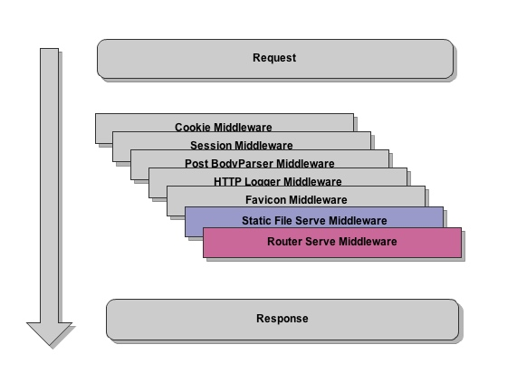


##### koa composite


multiple middleware into a single middleware for easy re-use or exporting.
This is exactly what koa-compose does, which Koa internally uses to create and dispatch the middleware stack.

```js
function compose(middleware){
  return function *(next){
    if (!next) next = noop();

    var i = middleware.length;

    while (i--) {
      next = middleware[i].call(this, next);
    }

    return yield *next;
  }
}
```


##### koa adapter

## 兼容koa1.x的中间件 - [koa adapter](https://github.com/th507/koa-adapter)

把es6的generator和yield的变成es7的async/await写法

```js
// use Koa 1.0 middleware
app.use(function*(next) {
  const start = Date.now()

  yield next

  const ms = Date.now() - start
  console.log(`${this.method} ${this.url} - ${ms}ms`)
})

// koa-logger@1 only support koa@1
const logger = require("koa-logger")

// use legacy middlewares with adapt(...)
app.use(adapt(logger))
```

##### 文件即是路由

```note

```

##### Valiate

```js
// 关于请求的入参验证
ctx.checkQuery('query', 'Invalid query').notEmpty();
ctx.checkQuery('type', 'Invalid type').
    isIn(baseSearchTypes.concat(['all', 'stock']));
    
function assertPagintionQuery(ctx) {
  ctx.checkQuery('page', 'Invalid page').notEmpty().isInt();
  ctx.checkQuery('size', 'Invalid size').notEmpty().isInt();
}

/*
  关于数据模型的验证
  mongodb 本身是schema-less，但这并不意味着我们容忍脏数据的随意插入（只是方便我们修改和扩展数据Schema，方便业务发展）
 */

 var joiUserSchema = Joi.object({
     name: Joi.object({
         first: Joi.string().required(),
         last: Joi.string().required()
     }),
     email: Joi.string().email().required(),
     bestFriend: Joi.string().meta({ type: 'ObjectId', ref: 'User' }),
     metaInfo: Joi.any()
 });
```


### 日常开发 与 Node.js

- es6
- npm scripts
- 性能调优
- 上线准备
- 安全

#### ES6化

##### 逐渐迁移legacy 代码

```js
// before

// after
var {pgae, xx} = req.query;

```

```note
很多旧代码用es5写起来比较verbose，可以使用最新的es6语法来改造，精简轻量很多。如解析构，模板字符串等等都不错。如：xxx
```

##### Babel 集成


```json
{
  "presets": ["es2015-node5"],
  "plugins": [
    "transform-async-to-generator",
    "syntax-async-functions"
  ]
}


```

```note
之前有些人吐槽说babel改过后，代码xxx，反正我们是没有遇到，代码不够复杂？！
首先确保你的基础node版本不小于5.6，Tip: 使用node 5确保我们的babel transpile 可以尽量让产出的代码精简 。因为大部分新的es6的语法在Node5中已经被实现了不需要babel再去transpile（听说有转错的风险还有性能也不好)

你会发现使用 similiairty 去跑没啥差别，我们看下 .babelrc 中的preset为 es2015-node5，然后就有两个babel的插件用于转换2a的代码

部署es6代码用于线上生产（先构建好 es5-compatible，加入到docker镜像中 ）
```

babel 编译和上线
eslint

#### npm scripts 构建过程

https://github.com/gf-rd/blog/issues/20
* npm scripts 使用 - 去掉多余的gulp
* npm 的一些hook点

- 及时更新依赖
- file watch
- 入库前检查
- 代码质量检查

```note
现在的一大趋势，是把多余的Gulp也好，Grunt也好，去除掉
为什么？因为npm本身提供很好的脚本支持，它不需要都与的gulp wrap(因为你还需要依赖于它去包少了或者它出bug都是问题），直接引入了你需要的工具如（uglifyjs, cssmin, babel等），通过灵活的hook来做一些构建task的设置

那我们看看用它可以具体做什么事情和我们又是怎么做到的
```

##### 及时更新的依赖

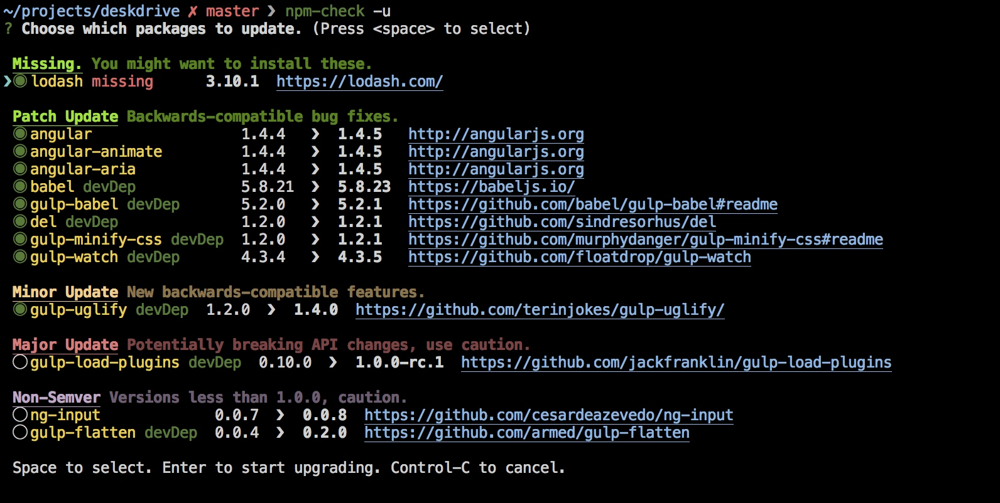

```note
想必大家对前不久的left-padding的事件都有耳闻。一位开发者下架了自己的仅仅用于格式化字符串的一个函数就导致了很多开源项目构建失败。所以我们给出的建议是通过shrinkwrap锁定住要上线的版本，同时定期的通过npm check来检查依赖组件的更新情况。
```

##### file watch


```json
{
  "main": "index.js",
  "scripts": {
    "dev": "nodemon --exec babel-node -- $npm_package_main"
  }
}
```

```note
我们当然也可以通过pm2来设置，看个人喜好。为他配置一些需要ignore的目录，然后自由编码去吧。
运行 npm run dev就可以了， 可以看到ns中的一些特殊变量如 $npm_package_main来指定babel-node这个解释器来运行我们的入口文件（这样在开发时不需要编译代码
nodemon  Simple monitor script for use during development of a node.js app.
```

##### 入库检查 


- npm run precommit : npm test
- npm run prepush : npm-run-all lint test test:deps
- npm run inspect : jsinspect

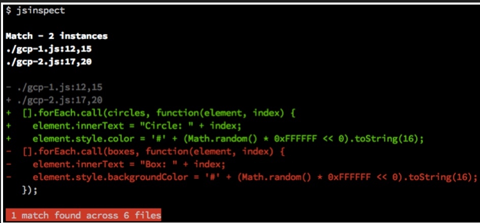


```note
入库前的检查
使用hurky可以修改你的git命令，提供hook点在commit/push/merge 前执行检查。
譬如我们利用npm的hook（pre)在提交commit前运行下我们的单元测试等（在那些），在推送代码仓库前，执行我们的lint检查是否良好的代码格式等等。
甚至我们可以运行inspect，看看我们是否有存在代码的copy&paste这种情况。

对这些进行测试：
那些经常要被修改的 change a lot 
那些有很高复杂度的 risky
那些重要功能/常被查看的 more traffic
```

##### 代码质量检查

- https://github.com/es-analysis/plato
- https://github.com/danielstjules/jsinspect (js smell 有截图)


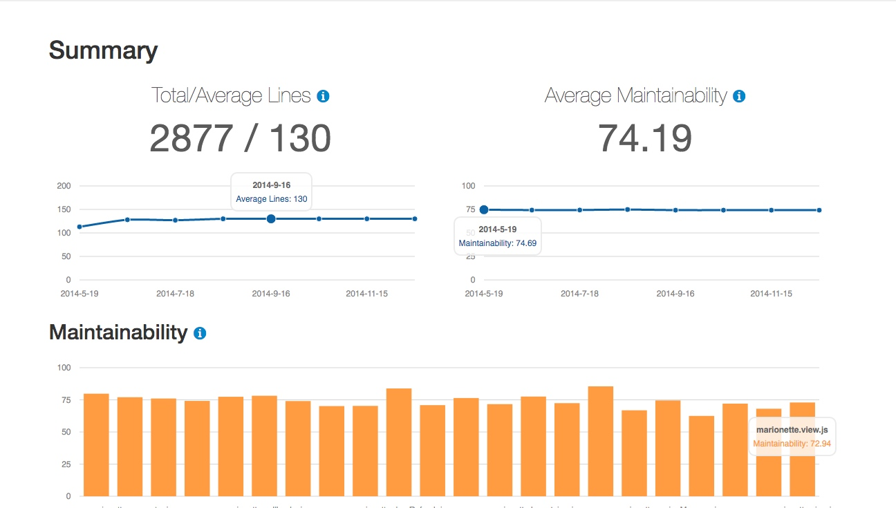


```note
我们真的应该非常关注我们的代码质量，想想看对于关键代码如基础组件，核心业务功能等。
因为我们也接手过（相信大家也是），之前有你在公司见过什么操蛋的代码这篇文字很有趣。我们能不能避免这些呢，不要给自己挖坑（事实上我们也乐于给自己挖坑哈 - 啪啪啪打脸程序员的九本指南）
从 代码复杂度， 代码行数（维持在100一下），eslint errors等等，去关注
我们也可以通过plato提供的基于日期对关键指标的统计看看代码改进的趋势，是不是朝着好的方向还是走想可怕的不好维护急需重构的深渊。

```


#### JS Smells 代码坏味道

- copy-paste
- repeat xxx

```note
我之前也从国外的slide整理过一篇文章，对于xxx进行了回顾。感兴趣的可以多看看，看看那些有问题的代码是不是和我们的很像，o(╯□╰)o。如xxx

我们当然可以通过 eslint rule 来发现：
如不允许复杂的switch语句，不允许重复reassign等，代码复杂度（if/else等嵌套不超过5等）
```

#### 在线上运行（Production Deploy & Security）

- 性能调优
- Express/Koa上线准备
- 安全

```note
当然咯，我们代码通过层层考验，最终准备上线了，最好还是需要一些确保如对性能进行调优，具体koa上线设置，安全上有哪些考虑等。
```

##### 性能调优

- [heap profiling](https://strongloop.com/strongblog/node-js-performance-heap-profiling-tip/)
- [内存泄露](https://strongloop.com/strongblog/node-js-performance-tip-of-the-week-memory-leak-diagnosis/)
- [CPU profiling](https://strongloop.com/strongblog/node-js-performance-tip-cpu-profiler/)
- [scaling proxies clusters](https://strongloop.com/strongblog/node-js-performance-scaling-proxies-clusters/)
- [event loop monitoring](https://strongloop.com/strongblog/node-js-performance-event-loop-monitoring/)
- [garbage collection](https://strongloop.com/strongblog/node-js-performance-garbage-collection/)

```note
我强烈推荐你们看strongloop（关于它和express那些事，link）出品的系列博文，看看如何优化。

// 对于这个几个调优：一句话介绍？！
通过heap profiling 看我们的内存使用是否合理，诸如对象，Request，String，Timer都占用了多少
通过内存泄露的诊断，看看我们是不是有一些没有回收的导致内存超量使用（1G左右)，快速泄露是非常容易诊断的，那么那些慢速的呢通常运行一天才会挂掉的呢
通过CPU profiling，我们看看那些同步代码消耗了计算资源
通过clusters，pm2 已经内建支持了不需要cluster模块引入，来在多核上同时绑定和serve同一个端口的请求提升应用的性能
node.js 非常关键的event loop，在这种单线程下NIO非阻塞IO下实现高并发模型。但是前提是你的代码不要阻塞它，导致后续的请求不能及时被serve。
最后是garbage collection，这篇文字可以看下v8是怎么管理内存的，heap被分成哪些不同空间。这对于想要精细控制gc非常有帮助。
```

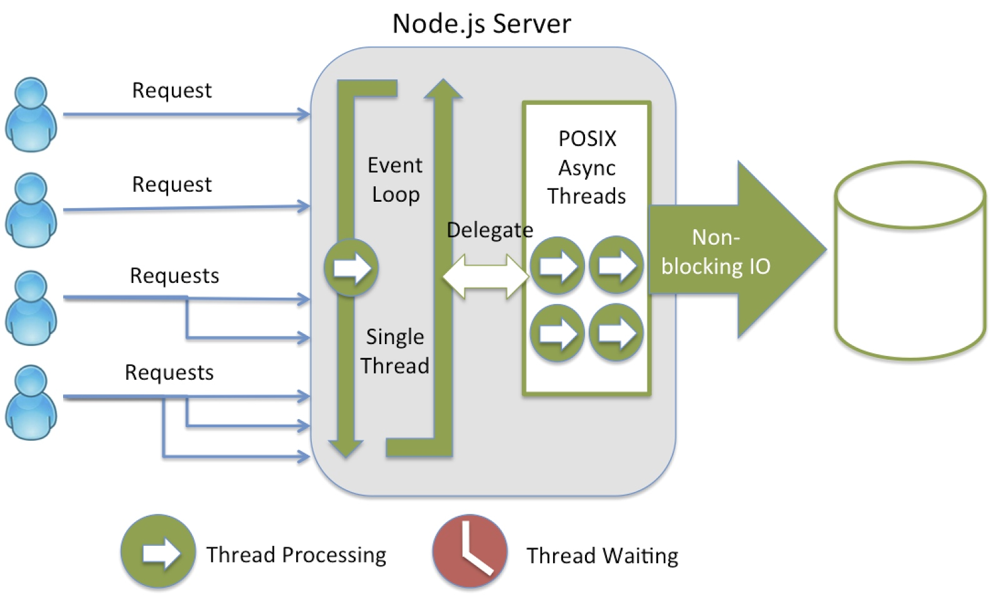


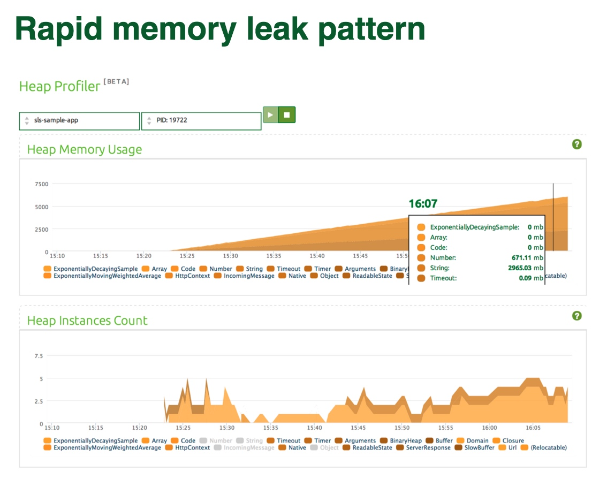


##### Best Practices in Production 

- Gzip压缩中间件/Nginx开启
- 静态文件中间件/Nginx加入
- 避免尽量少的复杂同步代码（Event Loop 监控）
- 打好全量的log信息（通过环境变量和进程信号调整）
- 合理的处理异常

```note

如果你的应用很轻不需要前置的nginx，那么需要在引入诸如gzip, static service 这些中间件来高效处理。或者如果你的应用如果有前面的反向代理的nginx，那么开启它们。
正如之前提到的，不要使用复杂的同步代码阻塞你的event loop。要打好全量的log来监控你应用发生的一切即包括了operation error也要含有system error等。还可以用类似debug模块调整log显示的级别如在线上问题诊断开启verbose，没问题后再把环境变量改成info，warning之类来通过发送进程信号量给应用调整。
PS在我们一些关键的金融理财业务很多log都是不允许的删除的为了审核和合规，所以做好rotate等
这方面很多公司都非常了积累了，最后又一些链接。
https://strongloop.com/strongblog/best-practices-for-express-in-production-part-two-performance-and-reliability/
```

##### 安全施工

- 不要使用过期老旧的版本框架
- 快点用上 https
- Helmet 中间件
- 安全使用Cookie & Session
- 确保其他组件依赖是安全的
- 其他一些基础的：[security-checklist](https://blog.risingstack.com/node-js-security-checklist)

```note

```

#### 其他（[Node] - 16年，新 Node 项目注意点）
  
  https://github.com/gf-rd/blog/issues/29
  
  - 异步函数支持回调惯例和Promise新写法
  - 智能的 .npmrc 和正确的版本管理做法
  - npm init

  ```note
  我们之前也分享过16年新node项目有哪些注意点的文章，这里也简单提下。
  
  版本管理刚才有提到，需要特别重要npm install要加上--save， save-dep的选项不然会漏掉，或者你可以通过npmrc来设置默认就保存等
  
  web应用开发的十二条军规是来自于rails社区关于web开发的一些通用型原则很有名很值得一读。
  还有诸如代码风格结合eslint的统一等等
  
  ```
 
 
### Web 开发 和 Node.js

- 关于openresty & haproxy & varnish
- 关于 mongodb, redis
- 关于log，监控和指标计算
- 关于扩容，kubernetes
- 关于 kakfa 等

```note
Web开发不仅仅包括了应用Server逻辑本身的书写，我们还需要关注上下游的组件。

如最前面的接入，可能需要openresty实现我们内嵌在nginx中的一些业务逻辑非常高性能（做一些风控和，session管理啊还是非常有效的）。锤子就把去年的门票收入捐给他们呢。
还有HAProxy做内部负载均衡，varnish做一些接口的缓存和精细控制
常见的存储用使用kv的redis热数据，mongodb文档型数据库来落地业务数据等非常不错在我们的场景下
关于log，一些关键的业务事件需要通过fluentd，flume等发送给大数据，还有一些要通过storm/spark流式计算来实施我们的内部数据的Dashboard和监控等
kafka利用它高吞出的性能做在我们业务里承担一些消息队列的角色
我们的扩缩容怎么做，docker容器需要管理，用k8s。

那么最终还是要回到我们应用的运行环境， docker容器和k8s中，看看微服务到底是。
- （画一个完成的链路图，把这些组件串联起来）
```


### 微服务和Node.js

#### 什么是微服务


```note
这种架构方式并没有非常准确的定义，但是在业务能力、自动部署、端对端的整合、对语言及数据的分散控制上，却有着显著特征。
微服务架构风格，就像是把小的服务开发成单一应用的形式，每个应用运行在单一的进程中，并使用如HTTP这样子的轻量级的API。这些服务满足某需求，并使用自动化部署工具进行独立发布。这些服务可以使用不同的开发语言以及不同数据存储技术，并保持最低限制的集中式管理。
```

```note
微服务特点，我们之前内部分享总结的。

```

```note
这是它的大概组成，在左下角是入口的api gateway也是我们node重点关注的地方，在具体微服务实现后专门被路由到需要服务发现的机制，单独的微服务需要怎么被部署要借助于容器等新的运维devops的支持。
```


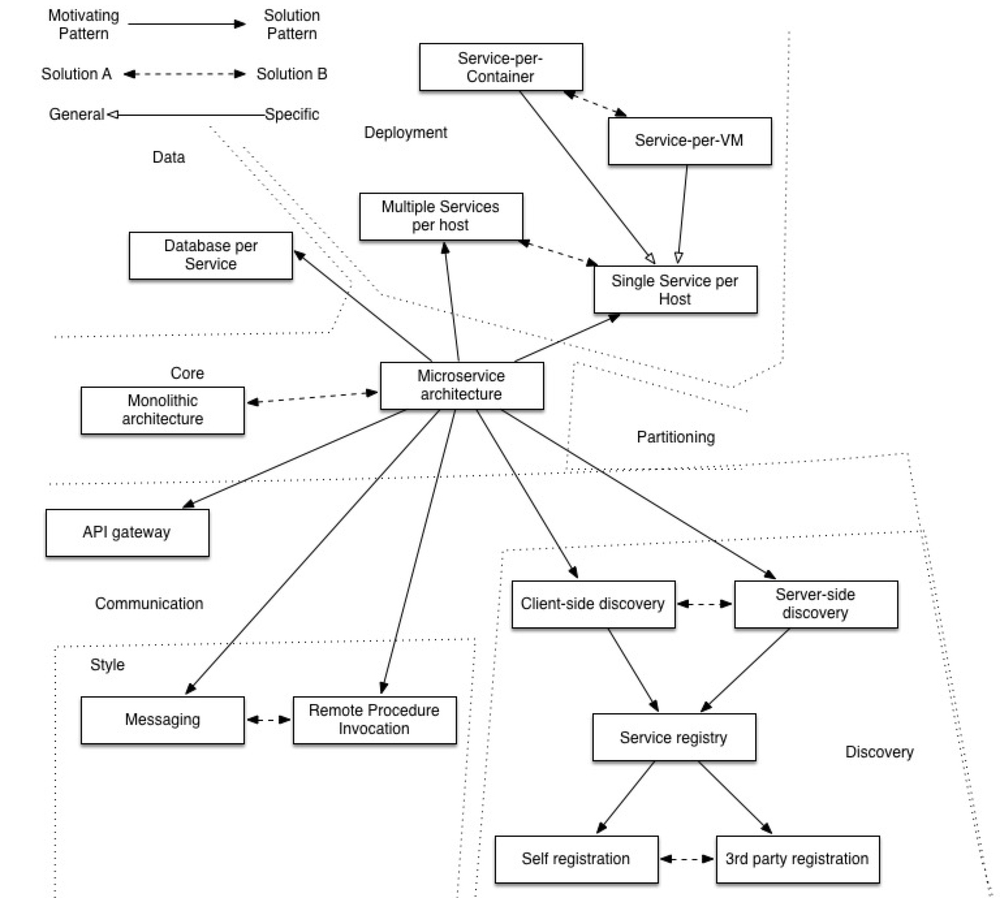


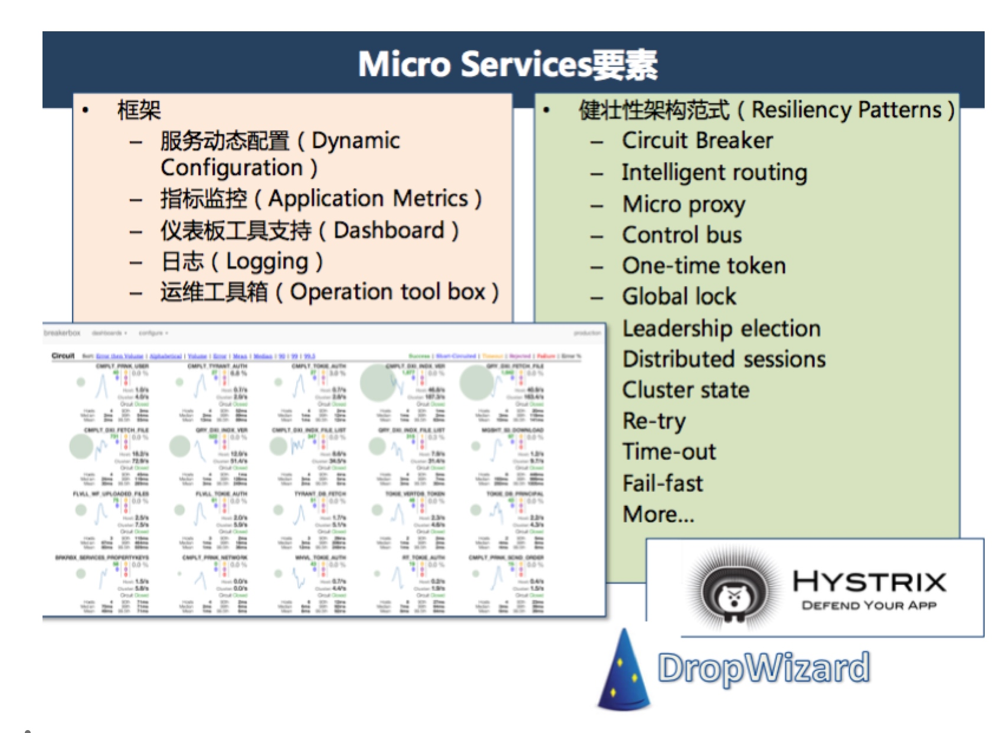


```note
加入之前的文章  https://github.com/gf-rd/blog/issues/10

需要在一些节点加上agent，实现动态扩容等(mind shift from 机器性能到集群扩展容，随时挂掉预设）

公司整理的一些规范：

- docker化
- 无状态。从而方便Kubernets扩缩容或调整机器资源（重启等），或者有状态恢复机制
- 环境变量配置优先（配置项通过env传入，如数据库，redis等
- 不要使用卷映射（如logs文件通常打到console中，然后fluentd传入大数据（走kafka; node_modules ADD file 到docker中
- 提供健康检查脚本

```


#### 微服务集成开发

- docker 部署
- 无状态（随时被动态扩缩容掉
- request监控（链路追踪
- 配置加载管理（环境变量

```note
那么我们想实践微服务，node.js web上需要做哪些工作了？

```

##### Docker 部署

学习 Docker 容器相关 - https://github.com/gaohailang/blog/issues/13


```note
Docker, 用来打包，分发和在容器中运行应用的好用工具。它和虚拟机是类似的，独立应用和它的依赖到独立自包含的直到你可以在其他地方运行、允许我们更有有效地使用计算资源、他们的主要差别体现在它们的架构实现方案上

这是它主要部分和命令的图片，感兴趣的又可以看我的翻译的文章[容器，Dokcer，虚拟化 - 写给开发者的入门指南]

这是关于docker操作相关的命令，我们集成在npm scripts 中了
```

##### request: 监控和debug

```js
require('request-debug')(rp, function(type, data, r) {
  // put your request or response handling logic here
  // Todo: request-post data lost? response json.stringify broken?
  if(type === 'request') {
    var {debugId, uri, method, body} = data;
    var userId = data.headers.userId;
    var more = body ? '' : ('-'+body) + userId ? '' : ('userId:'+userId);
    debug(`${debugId}-${method}-${uri}` + more);
  }

  if(type === 'response') {
    var {debugId, statusCode, body} = data;
    debug(`${debugId}-response-${statusCode}-`+JSON.stringify(body).slice(0, 155));
  }
});
```


```note
我们的web应用接受请求，也发送请求。 我们需要对这些请求进行记录和追踪，这样才能对一些用户的具体操作进行trakc甚至replay来辅助我们debug用户的线上问题。
尤其在我们微服务下，对于大量原子化的外部微服务的请求返回数据进行审视和使用杜绝可能存在的外部broken或者不符合预期的返回搞挂我们的应用，辅助和对口同事撕逼。

这是我们的代码，request本身支持debug模式，我们通过request-debug来对请求响应生命周期中的关键点进行监听，记录log。如状态码，响应时间，用户id，返回的部分结果等等。

我们当然可以通过一些工具来可视化这些，如下面risingstack和开源的zipkin，这个分布式的追踪系统来帮忙做这事情，如清晰看到整个请求链路中依赖的接口个别耗时等
```

##### request :链路追踪

- zipkin？！全链路监控 @ Google
- Trace is a visualised stack trace platform designed for microservices. http://trace.risingstack.com


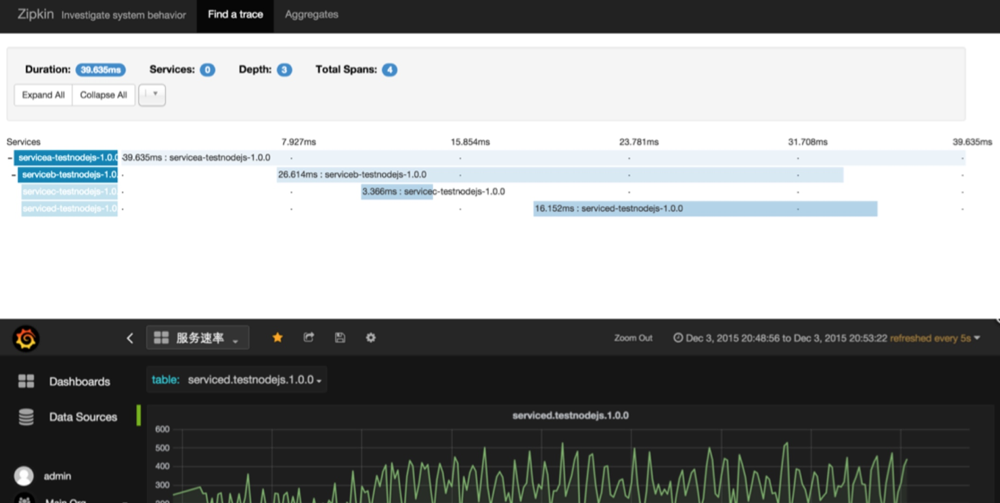


##### 配置加载&环境变量

关于配置我们集成了confit和shortstop（来自paypal）。

- 各种 protocol handler 
- 基于不同环境实现差异化配置
- 根据env变量自动加载

```js
// envfile
GFWC_storeExShopList=http://shopdev.gf.com.cn/api/store/shop/excellentshop/{id}/{page}/{size}
GFWC_storeSpShopList=http://shopdev.gf.com.cn/api/store/shop/special
GFWC_userFavShopList=http://shopdev.gf.com.cn/api/store/auth/favorites/shop/inorg

// 配置：
{
  "env": "development",
  "api": {
    "articleSearch": "env:GFWC_articleSearch",
    "shopSearch": "env:GFWC_shopSearch",
    "stockSearch": "env:GFWC_stockSearch",
    "portfolioSearch": "env:GFWC_portfolioSearch"
  }
}

```

```note
我们使用paypal的confit，来加载默认的配置，还会根据通过环境变量env来自动加载环境相关配置文件（做到差异化配置，还有很多增强协议如从环境变量中读取，从yaml文件，从特定文件读取内容，读取相对目录路径到绝对路径等等。
从环境变量读取你的外部依赖非常重要在微服务下面，我们依赖于此
社区还有nconf，选一个你顺手的使用起来吧。
```


### 我们和开源

- ES6
- Angular2
- 更多见Blog，我们的技术分享


```note
我们非常重视开源技术，去IOE化
所以从去年开始，开源上的做了一些工作，回馈社区：
我们团队大神在去年去QCon上海在将我们在es6上的一些前沿实践（业界也有我们es6-style-guide，可以再参考）
同时去去年尾声开始在angular2上写书准备，翻译了官方的guide，所以我们收到Google官方的邀请让我们推动ng2在国内文档化的工作。
更多的一些技术分享，可以在我们的github repo中看到
几个小图，从大变小的animation？！


可以看到正是我们在技术上的尝试，使得我们在node及其相关的技术选型形成来今天的风格，这是背景大家可以参考和对比。
```


### 结束

#### 加入这场 FinTech Storm

```note
一起来玩：
撩开袖子开始动手吧，到我们这里玩node.js吧

没过瘾，来海岸城约饭交流，SCC 8 楼年终我们会有分享会，更深的技术交流还有金融业务知识
```


#### Reference

- [广发IT招聘](http://it.gf.com.cn)
- 广发RD Github Organization
- 广发技术Blog
	- 2016 Node
- Node.js 在广发实践（本次ppt）

```note
reference，罗列ppt中有的那些

```


#### 扩展阅读：


##### API Server

https://strongloop.com/strongblog/nodejs-loopback-deployd-api-serve/
Todo: 更新下新时代的 relay falcor 数据接口


the first three generations of API apps. 

Birth of API Server:
like Java's Sprint MVC or Struts. Rails, Django. sails, geddy - include a database abstraction (typically an ORM for RDBMS only), templating libraries for rendering HTML, and a base controller for gluing the two together.  但是 ajax 变多，客户端自己灵活的渲染模板， mvc based backend stretched to serve as both the web application and API server. controllers would implement some methods that returned an entire rendered page while some methods that would return data


the Thin Server:
with app app moving into client and an entirely separate api server. both could be thinned out. web app no longer could directly access the database - this access instead could be pased through to the client. frameworks and databases: MongoDB, CouchDB, Sinatra, Express, Deployd, Meteor and others.

making data on the wire the first class citizen. surfacing database style APIs to JSON document databases. by need data on the wire to transfer state to and from various data sources(database, backend services, etc)
client require much more from an API server. access to raw data is important, but clients require much more from an API server: data aggregation, security, validation, and denormalization are usually a requirement.


Optimized API Delivery:
一个pass-through的api 不利于大型项目的扩展，因为需要access to many data sources. 打包请求的特性让 building api simple is helpful. 但是把这些特定当做黑盒子让customization 实施起来很头疼。最终 REST 和 http 变成了api服务器的标准，但是should not dictate the design of our API server


打开黑盒子！！
Next generation API servers should provide all the out of the box features clients require, especially the hard parts, and provide hooks everywhere. 如 app.remoutes() API 返回 apis http routes, schema definitions, 和其他跟你api服务器相关的元数据信息用于 scaffolding client app, generating 文档，


Data Accesses:
大型项目使用很多数据源： databases, other REST APIs, proprietary services等  API server should provide an abstract API to these data sources that allow you to describe relationships and do ad hoc aggregation and filtering.
to define a list of access controls. 通过配置很容『now only the user that owns an account may read or write it』


Aggregation and Mashup:
聚合通过简单的 joining of data. (denormalize data from various sources, drop data into JSON document database)
譬如用户首页包括的数据可能 span many datasources. aggregated into a single document and easily fetched when homepage is loaded. 问题是 latent ahead-of-time denormalization. 可能会过期（ Java的 Teiid 来解决， without latent copying or moving data）- Loopback 中是 allows you to define relationships between data, even from distributed data sources, and request the aggregate data based on relationship.
如the product and product detail data could come from an inventory database, and the related products could come from a separate backend REST or even SOAP API.

curl http://api.myapp.com/api/products/42
 ? filter[include] = productDetails
 & filter[include]  = relatedProducts


REST:
treat REST as transport, 而不是编程模型。API server 应该跟容易实施 REST api. 不要和 http 混合了你的数据应该也可以通过 web sockets 去访问(just provide a client access to another protocol)


浏览器和移动端应用， 复杂度在增加， 需要更高级的 data acdess. several generations of API servers and frameworks has risen to meet this demand by supporting the requirement of these rich applications.
;


<!--所有这些有名的标准规范有他们各种的奇怪之处。一些是过于复杂，一些只能处理读取没有覆盖到更新接口。一些又严重和REST走失。许多人选择构建它们自己的，但是最终也要解决它们设计上带来的问题。

我不认为现在有什么方案是个大满贯（完美的），但是下面是我对API应该有的功能的一些思考：
It should be predictable. Your endpoints should follow consistent conventions.
It should allow fetching multiple entities in one round trip: needing 15 queries to fetch everything you need on page load will give poor performance.
Make sure you have a good update story: many specifications only covers reads, and you’ll need to update stuff sometimes.
It should be easy to debug: looking at the Chrome inspector’s network tab should easily let me see what happened.
It should be easy to consume: I should be able to easily consume it with fetch, or have a well supported client library (like Relay)
我没有找到能覆盖这些需求的方案。如果有，务必让我知道。
同事考虑，如果你实施一个标准化的RESTful资源路径时，使用Swagger来文档化我们的API-->


